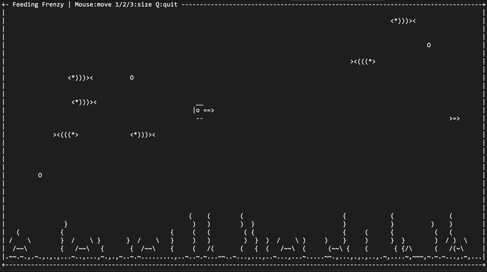

# TermFrenzy

A terminal-based game inspired by PopCap's Feeding Frenzy, built with Python and [blessed](https://github.com/jquast/blessed).



## Setup

```bash
python3 -m venv venv
source venv/bin/activate
pip install blessed
```

## Run

```bash
python src/game.py
```

### Aquarium Mode

Watch the fish swim around without a player — like ASCIIQuarium:

```bash
python src/game.py --aqua
```

## Controls

| Input | Action |
|-------|--------|
| Mouse | Fish follows cursor (game mode only) |
| Q | Quit |

## Features

- **Mouse-controlled** ASCII fish that swims toward your cursor
- **Eat smaller fish** to earn points and auto-grow (small → medium → big)
  - Level 0 fish (small sprites) give 2 points, level 1 fish give 5 points
  - Grow to medium at 20 points, big at 50 points
  - Score popup floats up from eaten fish
- **NPC fish** with depth layers (some swim in front, some behind the player)
  - Small fish are skittish and flee from the player (but can be caught)
- **Bubbles** that:
  - Spawn near the bottom and float upward
  - Each bubble has its own rise speed and wobble rate
  - Grow through stages (`.` → `o` → `O`)
  - Multi-stage pop animation (`*` → ring of droplets → fade) when reaching the top or touched by a fish (50% chance)
  - Run on real wall-clock time (independent of frame rate)
- **Sea floor** with depth layers — sand, swaying seaweed (`()` and `{}` styles), and rocks appear in front of or behind the player

## Changelog

### v0.3.0
- Eating mechanic: swim into smaller fish to eat them and earn points
- Auto-growth: player grows from small → medium → big based on score
- NPC fish split into level 0 (small, 2 pts) and level 1 (medium, 5 pts)
- Score display in title bar
- Floating score popups (+2, +5) on eating
- Removed manual 1/2/3 size switching

### v0.2.0
- Added `--aqua` aquarium mode: no player, just NPC fish swimming around
- Renamed title bar to TermFrenzy
- Moved source files to `src/`
- Added gameplay screenshot

### v0.1.0
- Initial release
- Mouse-controlled player fish with 3 sizes (small/medium/big)
- NPC fish with front/back depth layers
- Skittish small fish that flee from the player
- Bubbles with float physics and multi-stage pop animation
- Fish-triggered bubble popping (50% chance on contact)
- Sea floor with sand, swaying seaweed (two styles), and rocks
- Depth layering for sea floor decorations
