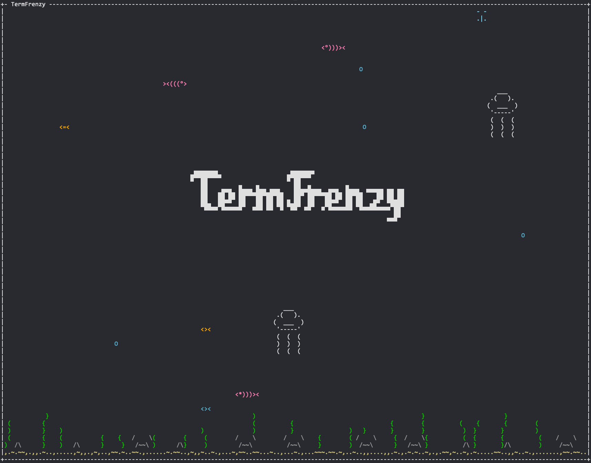

# TermFrenzy

A terminal-based game inspired by PopCap's Feeding Frenzy, built with Python and [blessed](https://github.com/jquast/blessed).



## Prerequisites

- Python 3.12+
- A terminal that supports mouse tracking (most modern terminals work)

## Setup

```bash
python3 -m venv venv
source venv/bin/activate
pip install -r requirements.txt
```

## Run

```bash
python src/game.py          # launches title screen
python src/game.py --aqua   # skip title screen, straight to aquarium
```

A title screen lets you choose between **Frenzy Mode** (gameplay) and **Aquarium Mode** (passive watching). The `--aqua` flag skips the title screen.

## Controls

| Input | Action |
|-------|--------|
| Arrow keys | Navigate title screen menu |
| Enter | Select menu option |
| Mouse | Fish follows cursor (frenzy mode only) |
| Q | Quit |
| R | Restart (on game over screen) |

## Features

- **Mouse-controlled** ASCII fish that swims toward your cursor
  - Detailed multi-row sprite with curved contours, dot-texture scales, and an expressive tail
  - Per-character coloring with a random color scheme each game (cyan, orange, blue, or green themed)
- **Eat smaller fish** to earn points and auto-grow (small → medium → big)
  - Level 0 fish (small sprites) give 2 points, level 1 fish give 5 points
  - Grow to medium at 20 points, big at 50 points
  - Score popup floats up from eaten fish
- **NPC fish** with depth layers (some swim in front, some behind the player)
  - Small fish spawn 3x more often than large fish
  - All fish flee from predators — player, larger NPC fish, and sharks
- **Bubbles** that:
  - Spawn near the bottom and float upward
  - Each bubble has its own rise speed and wobble rate
  - Grow through stages (`.` → `o` → `O`)
  - Multi-stage pop animation (`*` → ring of droplets → fade) when reaching the top or touched by a fish (50% chance)
  - Run on real wall-clock time (independent of frame rate)
- **Shark** predator that hunts fish and the player
  - Warning sign flashes at screen edge 2 seconds before the shark appears
  - Chases nearest target vertically and can turn around up to 5 times
  - Eats NPC fish on contact; eats small/medium player → game over
  - Big player can eat the shark for 10 points
- **Jellyfish** hazard that floats upward from the sea floor
  - Animated wavy tentacles (2-frame `()` animation)
  - Stings player and NPC fish on contact — slows to 30% speed for 1 second
  - Player gets a dazzling wavy `~` flash effect when stung
  - Cannot be eaten — unless Gold Frenzy is active
- **Gold Fish** — rare, fast-swimming golden fish with a sparkle trail
  - Spawns every 45-60 seconds, zooms across the screen
  - Any player size can eat it — the challenge is catching it
  - Eating it triggers **Gold Frenzy** for 10 seconds:
    - All fish, jellyfish, sharks, and bubbles turn gold
    - Player can eat anything — larger fish, jellyfish, even sharks
    - All points are doubled
    - Gold sparkle particles fill the screen
    - Flashing "GOLD FRENZY" countdown in the title bar
- **Game over & restart** — shark killing the player shows a game over screen with final score; press R to restart or Q to quit
- **Sea floor** with depth layers — sand, swaying seaweed (`()` and `{}` styles), and rocks appear in front of or behind the player

## Features Coming

- Levels
- Eating animation
- Fish groups
- More fish varieties (always)

## Changelog

See [CHANGELOG.md](CHANGELOG.md) for full version history.
